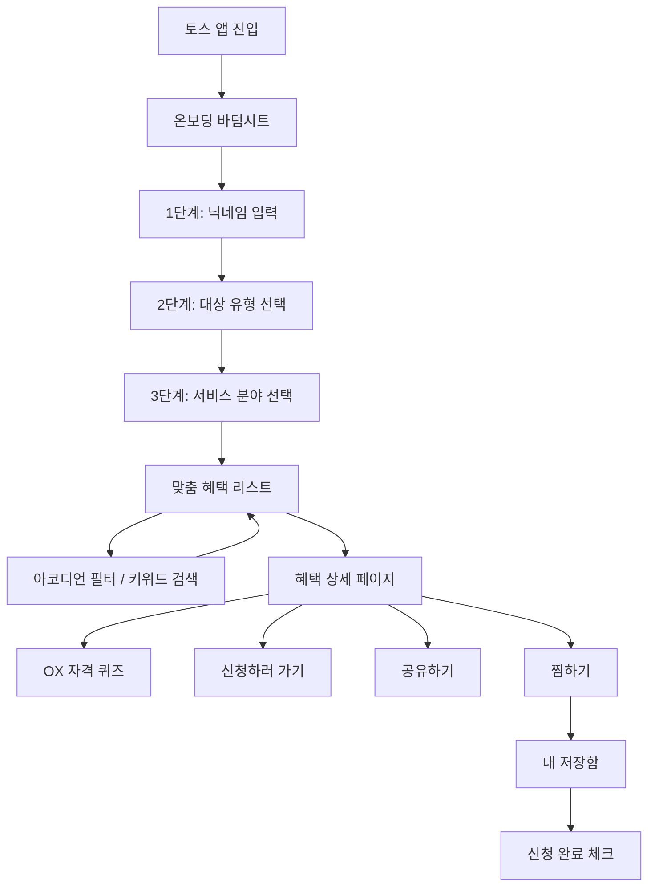

# 내게 맞는 혜택 알리미

> 몰라서 놓친 숨은 정부 지원금을 찾아드려요.


---

## 제품 소개

정보 불균형과 복잡한 탐색 과정 때문에 개인이 놓치고 있는 **공공서비스 및 정부 보조금**을 쉽고 빠르게 찾아주는 웹 애플리케이션입니다.

사용자의 **대상 유형**과 **서비스 분야**에 맞춘 2단계 필터링, 토스(Toss) 디자인 시스템 기반의 직관적인 UI(OX 퀴즈, 스마트 저장함)를 통해 공공 서비스의 진입 장벽을 낮춥니다.

### 핵심 타겟

| 타겟 | 관심 혜택 |
|------|-----------|
| 청년/구직층 | 취업 장려금, 월세 지원, 청년 수당 |
| 임산부/부모층 | 아동수당, 출산 축하금, 보육 바우처 |
| 소상공인/농업인 | 사업장 지원금, 경영 안정 자금, 세제 혜택 |
| 시니어/취약계층 | 기초연금, 노인 일자리, 저소득층 복지 |

### 사용자 스토리

- "공공기관 사이트는 너무 복잡해. 내 상황에 맞는 지원금만 딱 골라서 보고 싶어."
- "긴 안내문을 읽기 귀찮아. 내가 지원 자격이 되는지 OX 퀴즈처럼 직관적으로 알고 싶어."
- "찜해둔 혜택을 나중에 다시 보거나, 이미 신청한 혜택은 '완료' 처리해서 성취감을 느끼고 싶어."
- "좋은 혜택을 발견하면 카카오톡으로 가족이나 친구에게 바로 공유하고 싶어."

---

## 주요 기능

### MVP

| 기능 | 상세 |
|------|------|
| **2단계 맞춤 온보딩** | 첫 방문 시 바텀시트 3단계 폼 (닉네임 → 대상 유형 10종 → 서비스 분야 8종). 완료 시 URL 파라미터로 즉시 필터 적용. 토스 인증 Mock 포함. |
| **혜택 탐색 & 필터** | 공공데이터 API 연동 리스트. 아코디언 UI 기반 다중 필터(서비스 분야·지원 유형·대상 유형, AND 조건) + 키워드 검색. 정렬 4종(인기순·마감임박순·최신순·이름순). 페이지네이션. |
| **자동 생성 OX 자격 퀴즈** | 공공데이터 '지원대상' 텍스트를 정규식·키워드 매칭으로 파싱하여 OX 질문을 자동 생성. 원본 텍스트도 함께 표시. |
| **스마트 저장함** | 혜택 찜하기 + '신청 완료' 체크. 상태 필터(전체/진행 중/신청 완료) + 카테고리 칩 필터. 삭제 시 4초 Undo 토스트 지원. |
| **네이티브 & 카카오 공유** | 커스텀 ShareSheet 바텀시트(카카오톡·문자·이메일·X·페이스북·LINE·텔레그램·링크 복사). 카카오 SDK Feed 카드 공유 및 Web Share API 지원. |

### Phase 2 (Mock)

| 기능 | 상세 |
|------|------|
| **토스 인증 연동** | 온보딩 1단계에서 "토스 인증으로 3초 만에 혜택 찾기" 버튼. 로딩→성공 3단계 애니메이션 후 Mock 데이터 자동 주입. |
| **푸시 알림 토글** | 혜택 상세 페이지에서 "마감 3일 전 알림 받기" 토글 스위치. localStorage로 상태 유지. |

---

## 정보 구조 (IA v2.0)

```
[홈: 대시보드]
 ├── 온보딩 바텀시트 (최초 1회 노출)
 │    ├── 1단계: 닉네임 입력
 │    ├── 2단계: 대상 유형 선택 (청년, 소상공인 등 10종)
 │    └── 3단계: 서비스 분야 선택 (8종)
 ├── 검색 & 필터 (아코디언 UI)
 │    ├── 활성 필터 뱃지 ("N개 적용됨")
 │    └── 키워드 검색창 (상시 노출)
 └── 혜택 리스트 (카드형)
      └── 정렬 옵션 (인기순/마감임박순/최신순/이름순)

[혜택 상세]
 ├── 혜택 요약 (지원 금액 및 기한 강조, D-Day 뱃지)
 ├── 푸시 알림 토글 (Phase 2 Mock)
 ├── 지원 자격 체크 (자동 파싱된 OX 퀴즈 & 원본 텍스트)
 ├── 필요 서류 및 상세 안내
 └── [하단 고정 액션바] 신청하러 가기 / 찜하기 / 공유하기

[내 저장함]
 ├── 상태 필터 (전체 / 진행 중 / 신청 완료)
 ├── 카테고리 칩 필터 (서비스 분야 기반)
 ├── 진행 중인 혜택 (리스트)
 │    └── 찜 해제 (실행 취소 토스트 지원)
 └── 신청 완료 항목
      └── '신청 완료' 상태 체크/해제 (시각 피드백 적용)
```

---

## 사용자 흐름



---

## 기술 스택

| 카테고리 | 기술 |
|----------|------|
| 프레임워크 | Next.js 16 (App Router, Server Components, Suspense) |
| UI 라이브러리 | React 19, Tailwind CSS 4, Framer Motion 12, Lucide React |
| 언어 | TypeScript 5 |
| 외부 API | [공공데이터포털](https://www.data.go.kr/) - 행정안전부\_대한민국 공공서비스(혜택) 정보 |
| 소셜 연동 | Kakao JavaScript SDK (Feed 공유) |
| 상태 관리 | React Hooks + localStorage |
| 패키지 매니저 | npm |

---

## 프로젝트 구조

```
src/
├── app/                          # 라우팅
│   ├── page.tsx                  # / (홈 대시보드)
│   ├── benefit/[id]/page.tsx     # /benefit/:id (혜택 상세)
│   ├── saved/page.tsx            # /saved (내 저장함)
│   ├── layout.tsx                # 루트 레이아웃
│   ├── globals.css               # 글로벌 스타일
│   ├── loading.tsx               # 홈 스켈레톤 UI
│   └── not-found.tsx             # 404 페이지
│
├── components/
│   ├── home/                     # 홈 페이지 컴포넌트
│   │   ├── OnboardingModal.tsx   #   온보딩 바텀시트 (3단계 + 토스 인증 Mock)
│   │   ├── HomeContent.tsx       #   메인 콘텐츠 (인사말, 필터 상태 관리)
│   │   ├── QuickFilter.tsx       #   아코디언 필터 + 키워드 검색
│   │   ├── SortSelector.tsx      #   정렬 드롭다운
│   │   ├── BenefitCard.tsx       #   혜택 카드 (D-Day 뱃지 포함)
│   │   ├── BenefitList.tsx       #   카드 리스트 (Framer Motion 애니메이션)
│   │   ├── BenefitLoader.tsx     #   서버 사이드 데이터 페칭 + 정렬
│   │   ├── BenefitListSkeleton.tsx # 로딩 스켈레톤
│   │   ├── Pagination.tsx        #   페이지네이션
│   │   └── FallbackBanner.tsx    #   API 오류 안내 배너
│   │
│   ├── benefit/                  # 혜택 상세 컴포넌트
│   │   ├── BenefitSummary.tsx    #   요약 정보 (금액, D-Day 강조)
│   │   ├── EligibilityCheck.tsx  #   OX 자격 퀴즈
│   │   ├── RequiredDocuments.tsx  #   필요 서류 목록
│   │   ├── ActionButtons.tsx     #   하단 고정 액션바
│   │   ├── ShareSheet.tsx        #   공유 바텀시트 (8개 플랫폼)
│   │   ├── PushAlarmToggle.tsx   #   푸시 알림 토글 (Phase 2 Mock)
│   │   └── BenefitDetailClient.tsx # 클라이언트 래퍼
│   │
│   ├── saved/
│   │   └── SavedContent.tsx      #   저장함 (상태/카테고리 필터, Undo 토스트)
│   │
│   ├── layout/
│   │   └── Header.tsx            #   상단 헤더 (저장함 링크)
│   │
│   └── KakaoSDK.tsx              # 카카오 SDK 로더
│
├── hooks/
│   └── useSavedBenefits.ts       # 찜/신청완료 상태 관리 (localStorage 연동)
│
├── lib/
│   ├── api.ts                    # 공공데이터 API 통신 + 데이터 매퍼
│   ├── types.ts                  # Benefit 타입 및 필터 상수 정의
│   ├── constants.ts              # localStorage 키 상수
│   ├── parseDate.ts              # 신청 기한 파싱 + D-Day 계산
│   ├── parseEligibility.ts       # 지원대상 텍스트 → OX 질문 변환
│   ├── url-helpers.ts            # URL 파라미터 빌더
│   ├── mock-benefits.ts          # Mock 데이터 (API 폴백용)
│   ├── filter-benefits.ts        # 필터링 유틸리티
│   └── api-types.ts              # API 응답 타입 정의
│
└── types/
    └── kakao.d.ts                # Kakao SDK 타입 선언
```

---

## 시작하기

### 1. 저장소 클론

```bash
git clone https://github.com/<your-username>/my-toss-benefits.git
cd my-toss-benefits
```

### 2. 의존성 설치

```bash
npm install
```

### 3. 환경 변수 설정

프로젝트 루트에 `.env.local` 파일을 생성합니다.

```env
# 공공데이터포털 API 인증키 (Decoding)
# https://www.data.go.kr/ 에서 발급
NEXT_PUBLIC_PUBLIC_DATA_API_KEY=your_api_key_here

# 카카오 JavaScript 키 (카카오톡 공유 기능용)
# https://developers.kakao.com/ 에서 발급
NEXT_PUBLIC_KAKAO_JS_KEY=your_kakao_js_key_here
```

> API 키가 없어도 **Mock 데이터로 자동 폴백**되어 기본 동작을 확인할 수 있습니다.

### 4. 개발 서버 실행

```bash
npm run dev
```

[http://localhost:3000](http://localhost:3000)에서 확인할 수 있습니다.

### 5. 프로덕션 빌드

```bash
npm run build
npm start
```

---

## 성공 지표 (KPI)

| 지표 | 설명 |
|------|------|
| 온보딩 완료율 | 바텀시트 3단계를 이탈 없이 완료하고 리스트를 확인한 사용자 비율 |
| 전환율 | 혜택 상세에서 '신청하러 가기' 또는 '공유하기' 버튼을 누른 비율 |
| 저장/완료 액션 수 | 사용자가 혜택을 찜하거나 '신청 완료' 상태로 전환한 횟수 |

---

## Future Roadmap

현재는 1인 개발 프로젝트로서 프론트엔드 모의(Mock) 기능으로 구현되어 있으나, 추후 사업자 등록 및 제휴를 통해 아래와 같은 공식 연동을 계획하고 있습니다.

| Phase | 목표 | 상세 |
|-------|------|------|
| **2.1** | 정식 사업자 등록 및 앱인토스 파트너십 체결 | 비바리퍼블리카(토스) B2B 파트너 센터 가입 및 미니 앱 정식 입점 심사 진행 |
| **2.2** | 토스 인증(Toss Cert) API 정식 연동 | 사용자 동의 기반의 소득 및 가구 정보 자동 매칭 시스템 구현 (수동 입력 대체) |
| **2.3** | Toss Push API 기반 알림 서비스 활성화 | 서비스 워커 및 토스 알림 센터를 활용한 실제 마감 3일 전 맞춤 푸시 발송 시스템 구축 |

---

## 라이선스

MIT License
